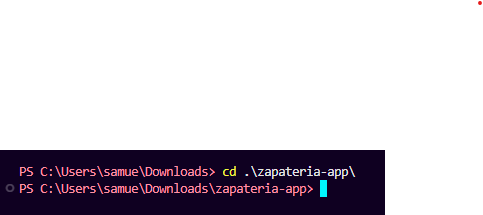
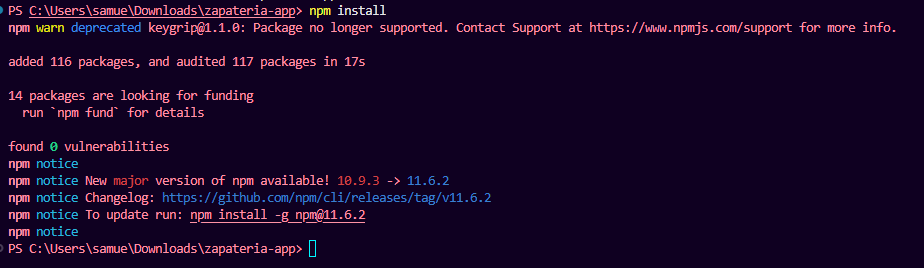

# INSTRUCCIONES DE INSTALACIÓN Y CONFIGURACIÓN

## Zapatería Aether - Entorno de Desarrollo

### 1. Requisitos Previos

Antes de comenzar, se debe asegurar de tener instalado en el dispositivo:

- **Node.js** versión 18 o superior
- **npm** (se instala automáticamente con Node.js)
- Un editor de código (recomendado: Visual Studio Code)
- Un navegador web moderno (Chrome, Firefox, Edge, etc.)

#### Verificar versiones instaladas

Abre una terminal y ejecuta los siguientes comandos para verificar que tienes las versiones correctas:

```bash
node --version
```
**Resultado esperado:** v18.x.x o superior

```bash
npm --version
```
**Resultado esperado:** 9.x.x o superior


---

### 2. Descarga del Proyecto

Descarga el archivo comprimdo zapateria-app.zip
Extrae el contenido y navega a la carpeta con el siguiente comando:
```bash
cd zapateria-app
```


---

### 3. Instalación de Dependencias

Una vez dentro del directorio del proyecto, instala todas las dependencias necesarias:

```bash
npm install
```

**¿Qué hace este comando?**
- Lee el archivo `package.json`
- Descarga e instala todas las dependencias listadas
- Crea la carpeta `node_modules` con todos los paquetes necesarios
- Genera o actualiza el archivo `package-lock.json`

**Tiempo estimado:** 1-3 minutos (dependiendo de tu conexión a internet)

 
- Deberías ver múltiples líneas indicando la descarga de paquetes
- Al final verás un resumen con el número de paquetes instalados
- No deberían aparecer errores (warnings son aceptables)




---

### 4. Ejecución del Servidor en Modo Desarrollo

Para iniciar el servidor en modo desarrollo con hot-reload:

```bash     
npm run dev
```

**¿Qué hace este comando?**
- Ejecuta TypeScript sin necesidad de compilar previamente
- Utiliza `ts-node` para interpretar los archivos `.ts`
- Inicia el servidor Express en el puerto 3000
- Mantiene la sesión activa para ver cambios en tiempo real

**Salida esperada en la terminal:**
```
Server running on http://localhost:3000
```


---

### 5. Verificación del Funcionamiento

#### Paso 5.1: Acceder a la aplicación

Abre tu navegador web y visita:

```
http://localhost:3000
```

**Deberías ver:**
- La página principal de la Zapatería Aether
- Un catálogo de zapatos con imágenes
- Botones para añadir productos al carrito
- Una barra de navegación funcional


#### Paso 5.2: Probar funcionalidades básicas

1. **Verificar el catálogo:**
   - Deberías ver varios productos de zapatos
   - Cada producto debe tener: imagen, nombre, descripción, precio y talla

2. **Añadir al carrito:**
   - Haz clic en "Añadir al carrito" en cualquier producto
   - Deberías ver un mensaje de confirmación
   - El contador del carrito debería incrementarse

3. **Ver el carrito:**
   - Navega a la página del carrito (botón "Ver Carrito" o `http://localhost:3000/cart.html`)
   - Deberías ver los productos añadidos
   - Verifica que puedas cambiar cantidades y eliminar productos


---

### 6. Detener el Servidor

Para detener el servidor de desarrollo:

- Presiona `Ctrl + C` en la terminal donde está corriendo
- Confirma con `Y` si te lo solicita

---

### 7. Comandos Adicionales

#### Compilar para producción:
```bash
npm run build
```
Este comando compila los archivos TypeScript a JavaScript y los coloca en la carpeta `dist/`.

#### Ejecutar en modo producción:
```bash
npm start
```
Ejecuta la versión compilada (requiere haber ejecutado `npm run build` primero).

---

### 8. Estructura del Proyecto Verificada

Después de la instalación, tu estructura de carpetas debería verse así:

```
zapateria-app/
├─ node_modules/          # ✅ Creado por npm install
├─ public/
│  ├─ index.html          # ✅ Página principal
│  ├─ cart.html           # ✅ Página del carrito
│  ├─ js/
│  │  ├─ app.js           # ✅ Lógica del catálogo
│  │  └─ cart.js          # ✅ Lógica del carrito
│  └─ img/
│     └─ shoe_*.png       # ✅ Imágenes de productos
├─ src/
│  ├─ routes/
│  │  ├─ products.ts      # ✅ API de productos
│  │  └─ cart.ts          # ✅ API del carrito
│  ├─ types/
│  │  └─ index.d.ts       # ✅ Definiciones TypeScript
│  └─ server.ts           # ✅ Servidor Express
├─ package.json           # ✅ Configuración del proyecto
├─ package-lock.json      # ✅ Creado por npm install
├─ tsconfig.json          # ✅ Configuración TypeScript
└─ README.md              # ✅ Documentación
```

---

### 9. Solución de Problemas Comunes

#### Problema: "Puerto 3000 ya está en uso"
**Solución:**
```bash
# Windows
netstat -ano | findstr :3000
taskkill /PID [número_del_proceso] /F

# Mac/Linux
lsof -ti:3000 | xargs kill -9
```

#### Problema: "Cannot find module..."
**Solución:**
```bash
# Eliminar node_modules y reinstalar
rm -rf node_modules package-lock.json
npm install
```

#### Problema: "Permission denied"
**Solución:**
```bash
# Usar sudo en Mac/Linux (no recomendado en Windows)
sudo npm install

# O mejor, corregir permisos de npm
```

#### Problema: ERR_MODULE_NOT_FOUND]: Cannot find module 'C:....\src\routes\products.js' imported from C:\Users\samue\Downloads\zapateria-app\src\server.ts
**Solución**
En server.ts cambia el import de los archivos products y cart, cambia el .js por ts

Ahora para que pueda ejecutarlo sin problema 
```bash
#ve a tsconfig.json
#en la parte de compilerOptions añade las dos siguentes lineas de código
"allowImportingTsExtensions": true,
"noEmit": true

#Esto hará que no tengas problema con los imports y puedas ejecutar npm run dev normalmente.
```
---

## Conclusión
Si todos los pasos anteriores se completaron exitosamente, el entorno de desarrollo de Zapatería Aether está correctamente configurado y listo para trabajar.
